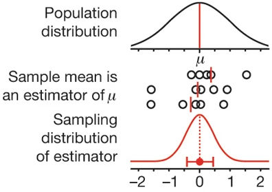

```{r message=FALSE}

library(tidyverse)
library(ggplot2)
library(cowplot)
library(moments)

```

Watch [Bunnies, Dragons and the 'Normal'
World](https://www.nytimes.com/video/science/100000002452709/bunnies-dragons-and-the-normal-world.html)
to refresh your knowledge of the Central limit theorem.

# Experiment

Load the file "data/loans_income.csv", and convert it into a vector.

```{r}

loans_income <- read_csv("/Users/ozodbekadkhamov/DataspellProjects/sample-statistics1/data/loans_income.csv")
loans_income <- loans_income$x

```

Take a sample of 1000 values from `loans_income`, and make a histogram.

```{r}

simple_sample <- sample(loans_income, size=1000, replace=TRUE)

ggplot(data.frame(x=simple_sample)) +
  geom_histogram(aes(x=x), bins=30)

```

Take a sample of 5 values, calculate the mean. Repeat this procedure
1000 times.

```{r}
sample_by_5 <- replicate(1000, sample(loans_income, size=5))
sample_by_5 <- colMeans(sample_by_5)

```

Modify the function `sample_by()` so it can take samples not only by 5.
Apply it to calculate sampling by 10 and 15.

```{r}

sample_by <- function(n) {
  x <- sample(loans_income, size=n)
  m <- mean(x)
  return(m)
}

sample_by_10 <- replicate(1000, sample_by(10))
sample_by_15 <- replicate(1000, sample_by(15))

```

We are going to make 4 histograms, one for each sample, but ggplot2
works only with data-frames, so we need to combine all vectors into one
with `c()`, and then add labels to distinguish which value belongs to
which sampling method.

```{r}

data <- data.frame(
  value = c(
    simple_sample,
    sample_by_5,
    sample_by_10,
    sample_by_15
  ),
  name = c(
    rep("simple", 1000),
    rep("by_5",  1000),
    rep("by_10", 1000),
    rep("by_15", 1000)
  )
)

```

Build histograms, mark them with different colors (fill).

```{r}

p <- ggplot(data, aes(x=value, fill=name)) +
  geom_histogram(bins=30)

p
```

Separate this plot into 4 histograms.

```{r, fig.asp=1}

p + facet_grid(rows=vars(name))

```

You can see, that ggplot2 put all histograms in a chaotic order. Is this
placement random?

Put the histograms into the correct order, first should be "simple" and
then will go "by 5", "by 10", and "by 15". In order to do that, you need
to factorize column "label".

```{r}
data$name <- factor(data$name, levels=c("simple", "by_5", "by_10", "by_15"))

p <- ggplot(data, aes(x=value, fill=name)) +
  geom_histogram(bins=30) +
  facet_grid(rows=vars(name))

p

```

What do you think about the standard deviation of of the last 3
distributions? What distribution fits better to model them? May be
exponential or binomial?

Add a vertical line to show the mean value of `loans_income`.

```{r fig.asp=1}

p + geom_vline(xintercept=mean(loans_income))

```

# Central limit theorem

The phenomenon demonstrated in the plot above is termed the **central
limit theorem**. It says that the means drawn from multiple samples will
resemble the normal curve, even if the source population is not normally
distributed, provided that the sample size is large enough and the
departure of the data from normality is not too great.

{width="355"}

**N.B.** Regardless of the distribution of the original data, sample
mean is normally distributed.

## Sample average

Calculate the arithmetic average for loans income and samples by 5, by
10, and by 15.

```{r}

mean(loans_income)
mean(sample_by_5)
mean(sample_by_10)
mean(sample_by_15)

```

Check the skewness and kurtosis of the samples.

```{r}

library(moments)

cat("skewness\n")
skewness(sample_by_5)
skewness(sample_by_10)
skewness(sample_by_15)

cat("\nkurtosis\n")
kurtosis(sample_by_5)
kurtosis(sample_by_10)
kurtosis(sample_by_15)

```

## Standard error

**N.B.** Standard Error can also be called *Standard Deviation of
Sample*.

Standard error of the sample average is calculated from the population's
SD:

$$
SE(\bar{X}) = { \sigma \over \sqrt{n} }
$$

Find the value of SE using this equation and compare it with the SD of
the samples.

```{r}
cat("sample by 5:\n")
sd(sample_by_5)
sd(loans_income) / sqrt(5)

cat("\nsample by 10:\n")
sd(sample_by_10)
sd(loans_income) / sqrt(10)

cat("\nsample by 15:\n")
sd(sample_by_15)
sd(loans_income) / sqrt(15)


```

# How large sample?

Create a population as a random 10,000 values from the uniform
distribution. Then using sampling by 2, 10, and 30, repeat the procedure
from above to make 4 histograms.

```{r fig.asp=0.5}
population <- runif(10000, min=100, max=200)

sample_by <- function(n) {
  x <- sample(population, size=n)
  m <- mean(x)
  return(m)
}

data <- data.frame(
  by_2  = replicate(1000, sample_by(2)),
  by_10 = replicate(1000, sample_by(10)),
  by_30 = replicate(1000, sample_by(30))
)

data <- rbind(
  data.frame(name="population", value=population),
  pivot_longer(data, 1:3)
)

data$name <- factor(data$name, levels=c("population", "by_2", "by_10", "by_30"))

p1 <- ggplot(data, aes(x=value)) +
  geom_freqpoly(bins=100) +
  facet_grid(cols=vars(name), scales="free_y")

p1


```

Repeat for a bimodal distribution composed of two normal distribution
with μ~1~=1 and μ~2~=2, σ=0.2.

```{r fig.asp=0.5}
population <- c(
  rnorm(5000, mean=1, sd=0.2),
  rnorm(5000, mean=2, sd=0.2)
)

data <- data.frame(
  by_2  = replicate(1000, sample_by(2)),
  by_10 = replicate(1000, sample_by(10)),
  by_30 = replicate(1000, sample_by(30))
)

data <- rbind(
  data.frame(name="population", value=population),
  pivot_longer(data, 1:3)
)

data$name <- factor(data$name, levels=c("population", "by_2", "by_10", "by_30"))

p2 <- ggplot(data, aes(x=value)) +
  geom_freqpoly(bins=100) +
  facet_grid(cols=vars(name), scales="free_y")

p2


```

Skewed distribution can be simulated with a Beta or Log-Normal
distribution on your choice.

```{r fig.asp=0.5}


population <- rbeta(10000, shape1=1.5, shape2=5)

data <- data.frame(
  by_2  = replicate(1000, sample_by(2)),
  by_10 = replicate(1000, sample_by(10)),
  by_30 = replicate(1000, sample_by(30))
)

data <- rbind(
  data.frame(name="population", value=population),
  pivot_longer(data, 1:3)
)

data$name <- factor(data$name, levels=c("population", "by_2", "by_10", "by_30"))

p3 <- ggplot(data, aes(x=value)) +
  geom_freqpoly(bins=100) +
  facet_grid(cols=vars(name), scales="free_y")

p3

```

**Conclusion:** The central limit theorem requires that n need to be big
enough. In practice, when n is at least 30 the distribution of sample
mean is approximately normal.

If the population is originally normally distributed then value of n is
insignificant.

```{r}


plot_grid(p1, p2, p3, ncol=1)
```

Questions:

1.  "A" has a right-skewed distribution, and we are calculating the
    sample mean from a random sample of 8 measurements. It is correct?
2.  "B" has a left-skewed distribution, and we inference population
    statistics from a random sample of 50 measurements.
3.  "C" has a normal distribution, and we are calculating the sample
    mean from a random sample of 3 measurements.

## Task 1

Let X̄ be the mean of a random sample of size 60 drawn from a population
with mean 120 and standard deviation 45. Find the probability:

1.  that X̄ assumes a value between 112 and 125;
2.  that X̄ assumes a value greater than 117;
3.  that X̄ assumes a value less or equal to 110.

```{r}
population_mean <- 120
population_sd <- 45

sample_mean <- population_mean
sample_sd <- population_sd / sqrt(60)

p <- pnorm(125, sample_mean, sample_sd) - pnorm(112, sample_mean, sample_sd)
sprintf("%.1f%%", p*100)


p <- 1 - pnorm(117, sample_mean, sample_sd)
sprintf("%.1f%%", p*100)

p <- pnorm(110, sample_mean, sample_sd)
sprintf("%.1f%%", p*100)

```

## Task 2
The average age at first marriage is 25 for women and 27.8 for men in
the US. If the standard deviation for women is four years, what is the
probability that a random selection 32 women have an average age at
first marriage between 26 and 27?

How do you think the age of the first marriage is distributed?

```{r}
p <- 1 - pnorm(117, sample_mean, sample_sd)
sprintf("%.1f%%", p*100)

pop_mean <- 25
pop_sd <- 4

sam_mean <- pop_mean
sam_sd <- pop_sd / sqrt(32)

p <- pnorm(27, sam_mean, sam_sd) - pnorm(26, sam_mean, sam_sd)
sprintf("%.1f%%", p*100)

```

## Task 3

The average salary for a psychology Ph.D. graduate specializing in
clinical, counseling, or school psychology is \$64,140 with a standard
deviation of \$18,405. Find the probability that a group of 31 randomly
selected psychologists has an average salary higher than \$74,000 per
year.

```{r}

pop_mean <- 64140
pop_sd <- 18405

sam_mean <- pop_mean
sam_sd <- pop_sd / sqrt(31)

p <- 1 - pnorm(74000, sam_mean, sam_sd)
sprintf("%.2f%%", p*100)

```

## Task 4

The average time to graduate from Oregon State University with a
bachelor's degree in 2008 was 4.68 years. If the standard deviation is
1.5 years, find the probability that a random sample of 40 graduates
from this university finished their studies between four and five years.

```{r}
pop_mean <- 4.68
pop_sd <- 1.5

sam_mean <- pop_mean
sam_sd <- pop_sd / sqrt(40)

p <- pnorm(5, sam_mean, sam_sd) - pnorm(4, sam_mean, sam_sd)
sprintf("%.2f%%", p*100)


```

## Task 5

Salaries in a very large corporation have a mean of \$62,000 and a
standard deviation of \$32,000. If 100 employees are randomly selected,
what is the probability their average salary exceeds \$66,000?

```{r}

pop_mean <- 62000
pop_sd <- 32000

sam_mean <- pop_mean
sam_sd <- pop_sd / sqrt(100)

p <- 1 - pnorm(66000, sam_mean, sam_sd)
sprintf("%.1f%%", p*100)

```

Assume the salary in this company is distributed following the
Log-Normal distribution. For known mean and sd we can find the
corresponding distribution parameters:

$$
\mu = ln \left[{
  m^2 \over \sqrt{ m^2 + s^2 }
} \right];
\;
\sigma = \sqrt{
ln \left[{
1 + {s^2 \over m^2}
} \right]
}
$$

Find the parameters of a Log-Normal distribution from the known mean and
sd. Check the results.

```{r}
mean_log <- log(pop_mean^2 / sqrt(pop_mean^2 + pop_sd^2))
sd_log <- sqrt(log(1 + pop_sd^2 / pop_mean^2))

x <- rlnorm(1000, meanlog=mean_log, sdlog=sd_log)
mean(x)
sd(x)


```

We can directly calculate the probability that a randomly selected
person has salary more than \$66,000.

```{r}
1 - plnorm(66000, meanlog=mean_log, sdlog=sd_log)


```

This probability $P(X > 66000) = 35.5\%$ is applicable to only one
person, while the previous $P(\bar{X} > 66000) = 10.6\%$ is our
inference about the salary of a group of employees.

## Exercise #6

It is recommended that backpacks weight less than ¼th of your body
weight. The average backpack with four textbooks and school supplies
weights 17.3 kg with a standard deviation 3.2 kg. If a randomly selected
group of 36 backpacks is weighted:

1.  what is the probability that the average weight for the packs is
    between 18.0 and 18.5 kg?
2.  to what range belongs the bottom 90% of the backpacks by weight?

```{r}

pop_mean <- 17.3
pop_sd <- 3.2

sam_mean <- pop_mean
sam_sd <- pop_sd / sqrt(36)

p <- pnorm(18.5, sam_mean, sam_sd) - pnorm(18.0, sam_mean, sam_sd)
sprintf("Pr(18 < X ≤ 18.5) = %.2f%%", p*100)

p <- qnorm(0.9, sam_mean, sam_sd)
sprintf("from 0 to %.2f kg", p)

```

## Task 7

Mid-term exam grades are normally distributed with a mean of 75 and a
standard deviation of 13. If samples of 25 students are selected at
random from the population, what is the mean of the sample means? What
is the standard error of the sample means?

Use equations from CLT, and prove them with simulation.

```{r}

cat("Central limit theorem\n")

pop_mean <- 75
pop_sd <- 13

pop_mean
pop_sd / sqrt(25)

cat("Simulation\n")

population <- rnorm(1000, pop_mean, pop_sd)

sample_by_25 <- replicate(10000, sample(population, size=100))
sample_by_25 <- colMeans(sample_by_25)

mean(sample_by_25)
sd(sample_by_25)

```

## Task 8

For women, heights are normally distributed with a mean of 162 cm and
standard deviation of 6.35. If samples of 49 women are selected at
random from the population, would the average heights found for each
sample be as varied as the individual measurements taken for each woman?

```{r}

pop_sd <- 6.35
sam_sd <- pop_sd / sqrt(49)
pop_sd == sam_sd

```

Answer: $\sigma > \sigma / \sqrt{49}$.

## Task 9

The average time to complete the final exam in Statistics is 95.82
minutes with standard deviation of 14 minutes. Find the probability that
a class of 60 students has an average completion time of more than 100
minutes.

```{r}

pop_mean <- 52174
pop_sd <- 7500

p <- pnorm(50000, pop_mean, pop_sd)
sprintf("%.1f%%", p*100)

sam_mean <- pop_mean
sam_sd <- pop_sd / sqrt(100)

p <- pnorm(50000, sam_mean, sam_sd)
sprintf("%.2f%%", p*100)

```

## Task 10

The average teacher's salary in New Jersey is \$52,174. Suppose that the
distribution is normal with standard deviation \$7500.

1.  What is the probability that a randomly selected teacher makes less
    than \$50,000 per year?

2.  If we sample 100 teachers' salaries, what is the probability that
    the sample mean is less than \$50,000 per year?

3.  Why is the probability in part (1) higher than the probability in
    part (2)?

```{r}


pop_mean <- 1518
pop_sd <- 325

p <- pnorm(1480, pop_mean, pop_sd) - pnorm(1440, pop_mean, pop_sd)
sprintf("%.1f%%", p*100)

sam_mean <- pop_mean
sam_sd <- pop_sd / sqrt(16)

p <- pnorm(1480, sam_mean, sam_sd) - pnorm(1440, sam_mean, sam_sd)
sprintf("%.1f%%", p*100)
```

Answer 3: The Central Limit Theorem suggests that the distribution of
sample means is narrower than the distribution for the population,
leaving less area (and hence probability) in the tails.

## Task 11

Assume SAT scores are normally distributed with mean 1518 and standard
deviation 325.

1.  If one SAT score is randomly selected, find the probability that it
    is between 1440 and 1480.
2.  If 16 SAT scores are randomly selected, find the probability that
    they have a mean between 1440 and 1480.
3.  Can the central limit theorem be used in part (2)?

```{r}

pop_mean <- 268
pop_sd <- 15

p <- pnorm(260, pop_mean, pop_sd)
sprintf("%.1f%%", p*100)

sam_mean <- pop_mean
sam_sd <- pop_sd / sqrt(25)

p <- pnorm(260, sam_mean, sam_sd)
sprintf("%.2f%%", p*100)

```

Answer 3: The Central Limit Theorem tells us that the distributions of
the sample means tend towards a normal distribution as the sample size
increases. In this case, the original population distribution was
already normally distributed, so all of the distributions of sample
means must already be normal.

## Task 12

The lengths of pregnancies are normally distributed with a mean of 268
days and a standard deviation of 15 days.

1.  If one pregnant woman is randomly selected, find the probability
    that her length of pregnancy is less than 260 days.
2.  If 25 pregnant women are put on a special diet just before they
    become pregnant, find the probability that their lengths of
    pregnancy have a mean that is less than 260 days (assuming that the
    diet has no effect).
3.  If the 25 women do have a mean of less than 260 days, does it appear
    that the diet has an effect on the length of pregnancy, and should
    the medical supervisors be concerned?

```{r}
pop_mean <- 75
pop_sd <- 10

p <- 1 - pnorm(100, pop_mean, pop_sd) + dnorm(100, pop_mean, pop_sd)
cat(sprintf("(1) %.1f%%\n", p*100))

p <- qnorm(1 - 0.025, pop_mean, pop_sd)
cat(sprintf("(2) %.1f\n", p))

p <- pnorm(60, pop_mean, pop_sd) * 100
cat(sprintf("(3) %.1f people\n", p))

sam_mean <- pop_mean
sam_sd <- pop_sd / sqrt(100)

p <- pnorm(70, sam_mean, sam_sd)
cat(sprintf("(4) %.5f%%\n", p*100))


```

Answer 3: Seeing a sample like this (i.e., with a mean of less than 260
days) is clearly a rare event (0.0038 is less than one percent). So if
the one and only sample we found had this mean pregnancy length, it
casts doubt as to whether or not the mean for these women is still 268
days (much like seeing the incredibly rare event of 99 out of a 100 coin
flips resulting in heads casts doubt on your belief that the coin
flipped is fair). The only thing that separates these women from the
general population is their special diet \-- so yes, it appears the diet
had an effect on the length of their pregnancy. Medical supervisors
should be concerned.

